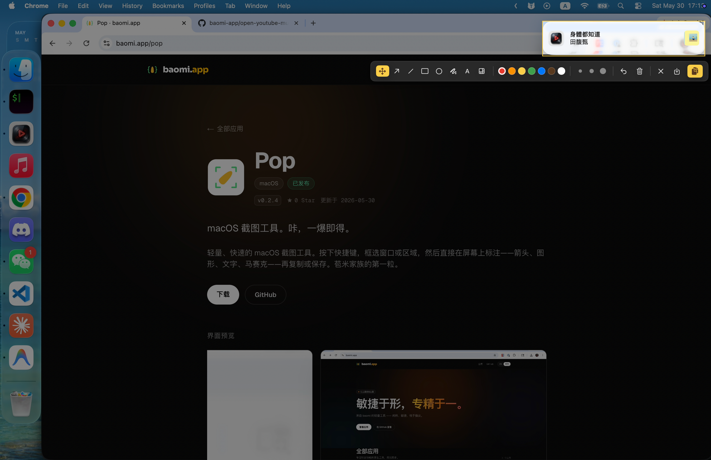
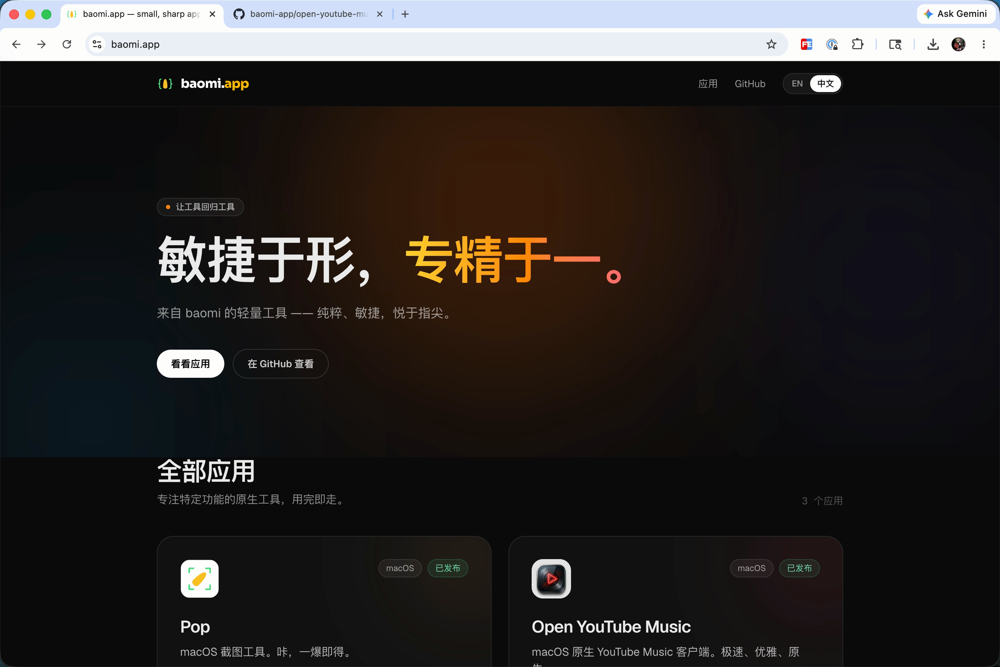
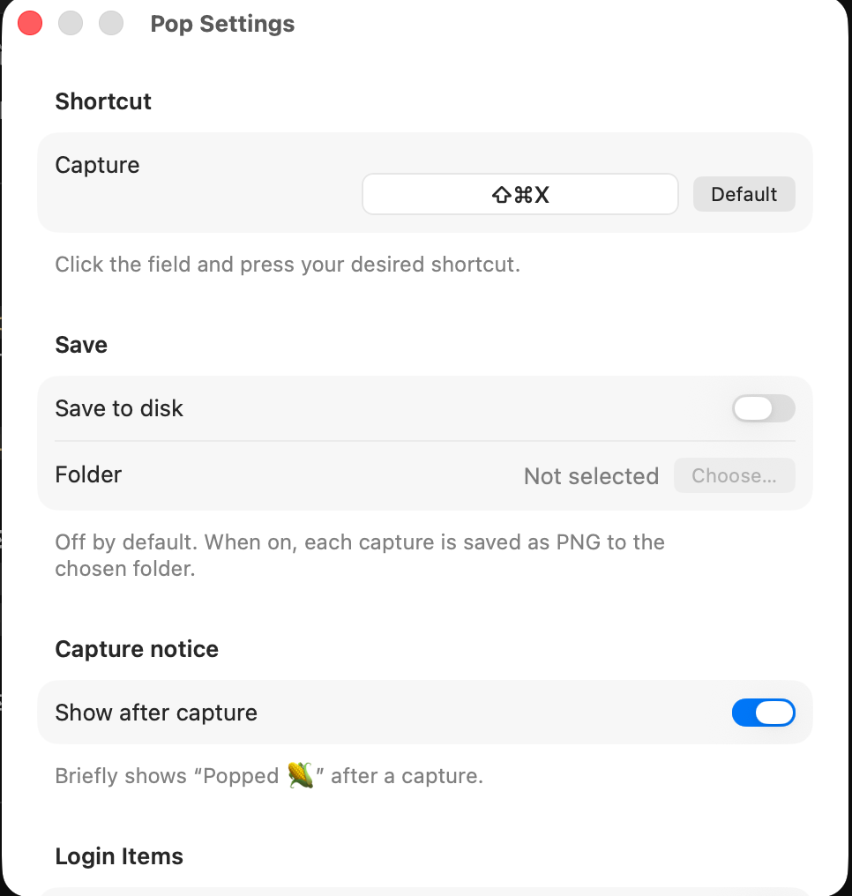

# Pop · 苞米的第一粒 🌽

macOS 截图工具。**咔，一爆即得。**

[English](README.md)




## 下载

到 [Releases](../../releases) 拿最新的 `Pop.zip`，解压把 `Pop.app` 拖进「应用程序」。

首次打开会被 Gatekeeper 拦（"Apple could not verify…"），任选其一处理：

**A. 终端命令**（最快）

```bash
xattr -dr com.apple.quarantine /Applications/Pop.app
```

**B. 系统设置救援**

1. 双击 `Pop.app` 被拦后，打开 **系统设置 → 隐私与安全性**
2. 滚到最底，看到 "Pop 被阻止使用" + **「仍要打开」** 按钮，点它
3. 输入密码 → 弹窗里再点「打开」

首次过了之后双击就正常。

## 使用

按 `⌘⇧X` 出选择层：



- 鼠标悬停 → 高亮命中窗口；**单击** = 截窗口
- **拖拽** = 截区域
- **↩** = 截全屏 · **⎋** = 取消

**区域截图进入原地标注。** 选中的区域当场冻结 in place，工具条贴着选区出现，直接在屏幕上画：

- 工具：箭头、直线、方框、圆圈、自由画笔、文字、马赛克（模糊）
- 7 种颜色 · 3 档线宽
- **复制**（`⌘C`）· **保存…**（`⌘S`，弹系统保存面板）· **撤销**（`⌘Z`）· 清空 · 取消（`⎋`）

窗口截图和全屏截图直接复制到剪贴板（不进编辑）。自定义快捷键、自动保存到本地、开机启动都在菜单栏图标 → 偏好设置。



首次截图系统会要求**屏幕录制**权限，授权后退出 Pop 再打开。

## 开发

需要 macOS 14+ 和 Xcode 26+。工程由 [XcodeGen](https://github.com/yonaskolb/XcodeGen)
从 `project.yml` 生成，`.xcodeproj` 不进 git（改了 `project.yml` 后重新生成即可）。

```bash
# 生成 Xcode 工程
xcodegen generate

# 在 Xcode 里开发
open Pop.xcodeproj

# 或：命令行构建 + 运行
scripts/make-app.sh Debug --run
```

## 技术栈

Swift + SwiftUI + AppKit + ScreenCaptureKit，原生、无第三方依赖。

## 目录

```
Sources/Pop/                  源码
  PopApp.swift                  入口（MenuBarExtra 菜单栏 App）
  Brand.swift                   品牌配色 + 微文案
  MenuContent.swift             菜单内容
  CaptureCoordinator.swift      截图流程编排
  RegionSelectionController     选择层（悬停/单击/拖拽）
  ScreenCaptureService          ScreenCaptureKit 截图
  Annotation.swift              标注模型（工具 + 调色板）
  AnnotationOverlay.swift       原地标注覆盖层 + 工具条 + 渲染
  HotkeyConfig / HotkeyManager / CarbonHotkey   全局快捷键
  SettingsView.swift            偏好设置
  ClipboardService / ImageSaver / HistoryStore / Toast
  Localizable.xcstrings         本地化文案（zh-Hans / en）
App/                          Info.plist + 签名 entitlements
project.yml                   XcodeGen 工程规格（生成 Pop.xcodeproj）
scripts/make-app.sh           构建脚本（xcodebuild）
```
